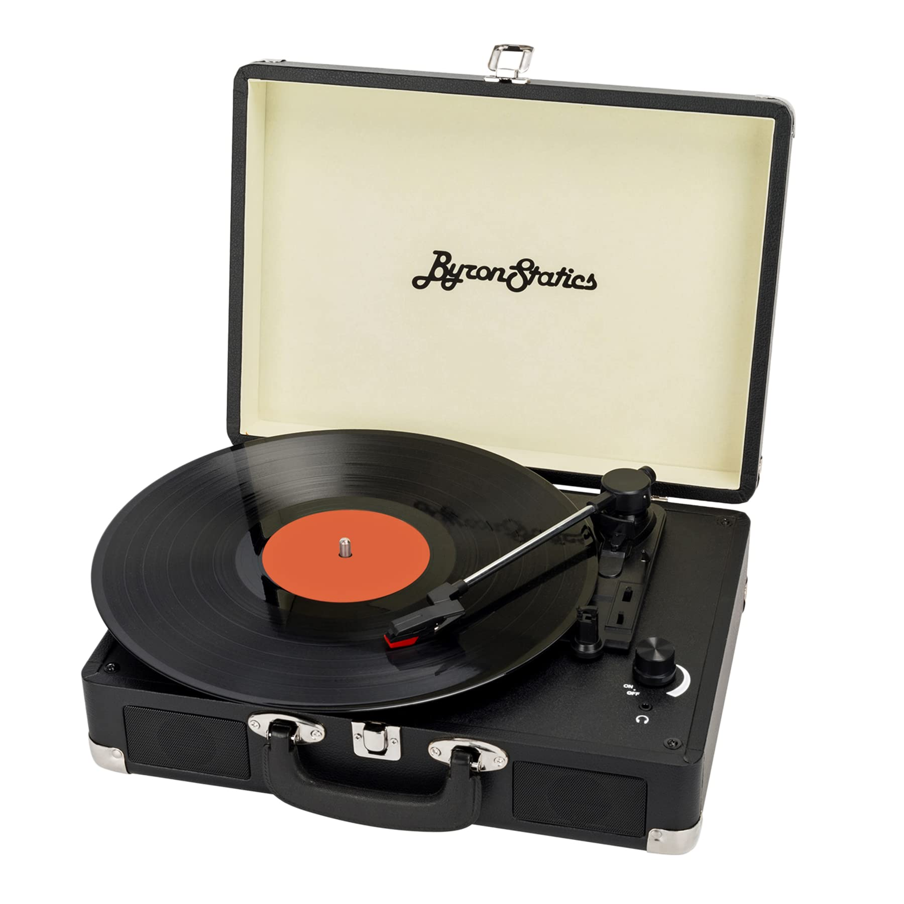
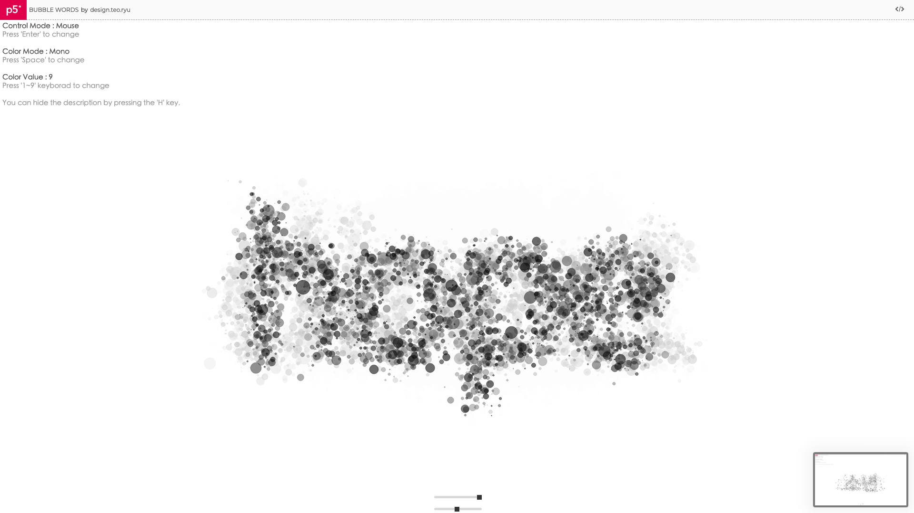
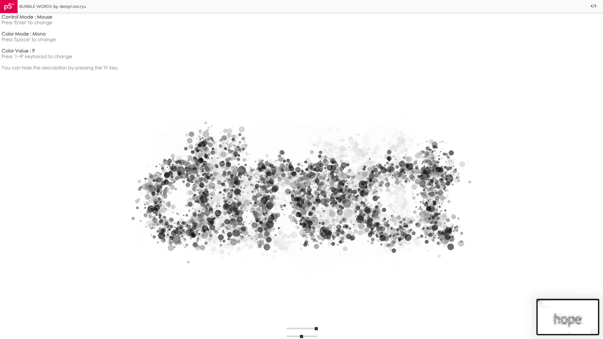

# yudu0706_9103_tutorial8
Instructions: Please use the mouse to click on any position of the circle during the demonstration, the music will start to play, and the circle will start to rotate at the same time (this operation is valid for any large circle). After clicking again, the music and the rotation will stop at the same time.

Details of my individual approach to animating the group code: 1.I use audio and mouse manipulation for my personal code.  2.In my personal code, the big circle with the circle is animated while the audio starts playing. 

References to inspiration
I was inspired by the Standard-playing Record (refer to the image below) I tried to draw an abstract record playing effect based on the group code.

My first repository for IDEA9103

<!-- Part1 -->
In this assignment, I aim to create randomized text drawn with bubbles or lines based on mouse movements, accompanied by corresponding background music. My inspiration stems from these two images.
Incorporated into this inspiration are the techniques learned this semester, including random text generation and toggling text through mouse movement or clicks.
So I believe this will effectively integrate my inspiration with the techniques I've learned this semester.

<!-- Part2 -->
The custom font is loaded using the preload() function. 
Interactive features are provided through the userStartAudio() function and mouseTarget. 
The setInterval() function is used to periodically change words and play synthesized sounds. 
The draw() function controls the interface updates using a counter, employing the frame variable for dynamic effects. 
The translate() and push()/pop() functions control the drawing coordinates and interface layers. 
These are the techniques that might be used to achieve this effect.

